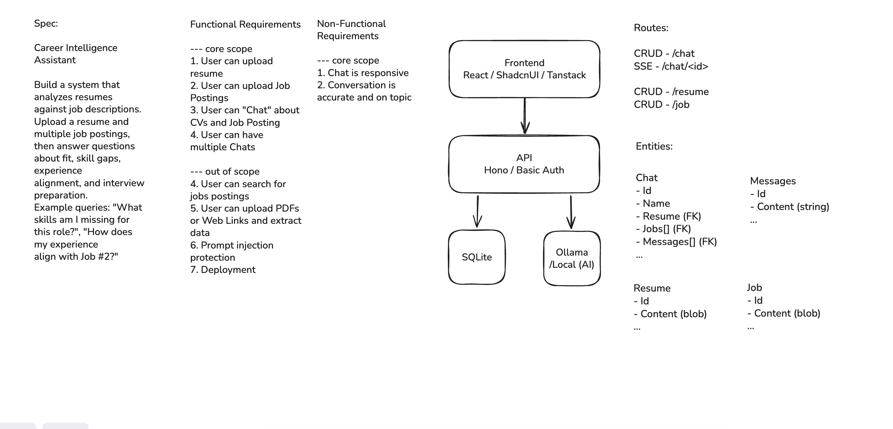

# Career Intelligence Assistant

## Spec

Build a system that analyzes resumes against job descriptions. Upload a resume and multiple job postings, then answer questions about:

- Fit
- Skill gaps
- Experience alignment
- Interview preparation

### Example queries

- "What skills am I missing for this role?"
- "How does my experience align with Job #2?"

## Setup

You need an Ollama API key for chat replies, and either Docker (with Compose v2) or Node.js with pnpm.

### 1. Get an Ollama API key

1. Go to `ollama.com` and create an account or sign in.
2. Go to `https://ollama.com/settings/keys` and click **Add API Key**.
3. Copy the generated key and store it somewhere safe. You will use it as `OLLAMA_API_KEY` below.

### 2. Configure the backend

```bash
cp backend/.env.example backend/.env
```

Edit `backend/.env`:

- `OLLAMA_API_KEY`: the key from step 1.

### 3a. Run with Docker (demo)

From the repository root:

```bash
docker compose up -d --build
```

This starts four services:

| Service | What it does | Address |
| --- | --- | --- |
| `frontend` | The built UI served by `vite preview`, which proxies `/api` to the backend | http://localhost:4173 |
| `backend` | The API, with the SQLite database in the `data` volume | http://localhost:3000 (docs at `/swagger`) |
| `ollama` | Local Ollama for embeddings (Ollama's cloud API cannot embed) | http://localhost:11435 |
| `pull-embedding-model` | One-off job that downloads `nomic-embed-text`, then exits | |

Compose points the backend at the `ollama` container and keeps the database in a volume, overriding those settings in `backend/.env`. The first run downloads the embedding model, so it takes a few minutes; the backend waits for it before starting.

Open http://localhost:4173.

If a port is in use, change it with `FRONTEND_PORT`, `BACKEND_PORT` or `OLLAMA_PORT`, for example `FRONTEND_PORT=8080 docker compose up -d`.

### 3b. Run locally for development (pnpm dev)

Requires Node.js 22+ and pnpm. The backend and frontend are separate pnpm packages, so install and run each from its own directory, in separate terminals.

Embeddings still need a local Ollama. Either run only that part of the compose file:

```bash
docker compose up -d ollama pull-embedding-model
```

or, with Ollama installed natively, run `ollama pull nomic-embed-text`. The Compose one is served at `http://localhost:11435/api`, the backend's default. A native Ollama listens on `http://localhost:11434/api`, so set `OLLAMA_EMBED_BASE_URL` to that in `backend/.env`.

```bash
# terminal 1
cd backend
pnpm install
pnpm dev          # http://localhost:3000, restarts on file changes

# terminal 2
cd frontend
pnpm install
pnpm dev          # http://localhost:5173, proxies /api to the backend
```

Open http://localhost:5173. Migrations run when the backend starts, and the database is `backend/local.db`. Restart `pnpm dev` in `backend/` after editing `.env`. Run `pnpm test` in `backend/` for the tests.

## Systems Diagram



[Excalidraw: resume-chatbot](https://excalidraw.com/resume-chatbot)

## Walkthrough

Annotated screenshots of the main flows: [docs/walkthrough.html](docs/walkthrough.html). Download or clone the repo and open the file in a browser.

## Approach and dev notes

### Deployment

The ideal deployment target is Cloudflare, which partly informed the choice of Hono and SQLite. The app could be deployed as a Cloudflare Worker, with the frontend served as static files and D1 as the database. The vector store would need to be replaced with Cloudflare Vectorize, and Ollama possibly with AI Gateway. Cloudflare also simplifies rate limiting and other production settings, and has decent built-in monitoring.

D1 has limitations that may make it unsuitable for heavy workloads. An alternative is AWS: the backend is already a container, so it could run on ECS with the frontend hosted in S3 as static assets. SQLite could then be replaced with Postgres on RDS, using pgvector for the embeddings. Rate limiting and other production settings could be configured through the Cloudflare proxy or AWS CloudFront.

### RAG and LLM choice

The initial design kept all job and resume text in the system prompt, as most cloud-based LLMs have large context windows and cache the prompt between turns. RAG would only have been useful with a large set of jobs, which I felt was unlikely here, although it does enforce a limit on job size. Since the task mentioned RAG, I added a simple embedding and vector search using the nomic embedding model and sqlite-vec. Nomic is small enough to be hosted locally in Docker as part of the deployment, and sqlite-vec is sufficient for the task.

The chunking method is not ideal. Given the time available I did not evaluate other methods, although I considered chunking by sentence as a simple alternative. I keep the full resume in the prompt and apply RAG only to the jobs, as the resume is the primary data source. Retrieval is a cosine distance search that returns the closest N chunks. It was the quickest solution, but it could be refined to keep the context smaller and more accurate.

Aside from RAG, I added a scoring mechanism adapted from Career Ops. It stands in for a simple tool or skill call that parses a structured response. This worked poorly with this model and would be better suited to a classifier model, as discussed in the "What I would do differently" section below. It works reliably enough with some custom response parsing and structured examples.

For the LLM I restricted myself to free options so the demo is simple to set up. The Gemma model is fast and good enough for this use case, but it is too verbose and too inaccurate at tool calling for production. I would evaluate better reasoning models and temperatures, potentially DeepSeek Flash or Gemini Flash, which have a good speed and price trade-off.

The prompts were inspired by the excellent <https://github.com/career-ops-hq/career-ops>. Prompt design takes a significant amount of time, so given the limited timescale I went with a refined, simple version. There was little to no testing of guardrails, prompt injection or evaluation. I put some basic prompt injection protection in place, but it could be refined further with chat context limits and perhaps an additional model to evaluate injection risks. For evaluation I would generate a dataset and compare runs, perhaps using promptfoo. For observability we could adopt Langfuse or reuse a cloud provider's built-in tools, such as Cloudflare's observability tools.

### Key technical decisions

I started with separate frontend and backend servers to keep a clean separation of concerns and allow clean vertical slices.

For the backend I chose Hono for its small size and simplicity. I considered NestJS and Next.js, but they seemed too bulky when the requirements were decent API routing, RPC and middleware. Hono is also easy to deploy on the cloud edge. Drizzle works well with multiple databases, particularly SQLite, and seemed a good fit as a simple ORM. I also added an OpenAPI spec for easy testing of the API endpoints. I chose SQLite because it is a good fit for development with little setup and for the targeted D1 deployment, although it could be swapped for Postgres.

For the frontend I used plain React with components from shadcn/ui for a simple, clean interface. TanStack Query handles requests with simple caching to reduce boilerplate, and Hono RPC provides a typed API client.

For AI, I initially planned a basic shadcn/ui chat interface with an SSE endpoint backed by Ollama or Cloudflare AI Gateway. After discovering the Vercel AI SDK, it seemed a better fit: it removed a lot of boilerplate, has nice features such as formatted tables and lists, and allows plugging in any AI provider. I settled on the Gemma model via Ollama because it is free, but in production I would evaluate other options.

I would normally take a TDD approach, but given the nature of this demo I limited test coverage to the more complex logic, for example saving AI responses to the database.

### How AI tools were used

The code was almost entirely generated by Claude Code, primarily Opus 5.5. Given the time limit and the boilerplate needed for setup, this seemed the most efficient approach. I gave guided instructions to generate vertical slices and the setup, then reviewed, edited and manually committed each change. I loosened this approach for the frontend, which was more volatile and open to change, and took a QA approach there since it is fairly simple to test.

I would usually keep a structured CLAUDE.md file with a rough overview and development best practices. For small, early projects I find that too volatile, so I prefer a hands-on approach until the project is stable. In addition to the base Claude configuration, I used a playwright-cli MCP so that Claude could QA its own work in the browser and tweak UI behavior. I also used remote Claude Code for some final touches, such as the move to Docker Compose and the initial setup documentation, which I reviewed and checked locally before merging.

### What I would do differently

- Evaluate different models, and ideally use a classifier model for the scoring element, such as Jev, Laya or Cloudflare's Clef.
- Evaluate different chunking methods and larger context sizes with an evaluation framework to see how the variations perform.
- Add an authentication and user system so that multiple users can use the app, possibly integrating Auth0.
- Address some bugs and UX issues, such as the slow embedding and forms not clearing correctly.
- Clean up some of the code: the service layer handles status codes, some code is over-guarded, and the Zod schemas are a little hard to parse (I would like to evaluate alternatives).
- Avoid keeping secrets in a plain `.env` file that an LLM can read. I would prefer a password manager such as the 1Password CLI to inject secrets at runtime, but as the API key is free and this is a demo, I relaxed this.
- Evaluate the RAG method. Adding the retrieved chunks to the system prompt was expedient, but I would have liked to evaluate adding them to the message chain instead, and to experiment with different vector search methods.

## Troubleshooting

- **Adding a job fails with "Could not index the job".** The embedding model is not available. With Docker, check `docker compose logs pull-embedding-model` and run `docker compose up -d` again to retry the download. Locally, check that Ollama is running and that `ollama list` shows `nomic-embed-text`.
- **Chat replies fail.** Check `OLLAMA_API_KEY`, `OLLAMA_BASE_URL` and `OLLAMA_MODEL` in `backend/.env`, then restart the backend.

## Stack

Built using Typescript, with React for the frontend and Hono for the backend. SQLite for the database and Ollama for the AI provider.

## Frontend

Resume Chatbot: a React chat frontend using Shadcn/UI components, TanStack Query and AI Elements for rapid development.

- **Sidebar:** a **New chat** button, your chats (with the resume and number of jobs each uses), and a link to the library. Each chat has a **…** menu to rename or delete it; deleting a chat removes its messages but keeps its resume and jobs.
- **New chat:** pick a resume and one or more jobs. The order you pick the jobs in is Job #1, Job #2, and so on, which is how you can refer to them in the chat.
- **Chat:** a centered conversation with suggested questions on an empty chat. The **Details** panel on the right shows the chat's resume and jobs, and lets you score each job: a global score out of 5, a band, confidence, the five dimensions with their evidence, things worth checking, and earlier runs. On smaller screens the sidebar and details open as drawers.
- **Library:** add, preview, rename and delete resumes and job postings (upload a file or paste text). A job must be given a name (a resume falls back to its file name). A resume or job that a chat uses cannot be deleted until those chats are deleted.
- **Links:** the address reflects where you are (`#/chat/<id>`, `#/library/resumes`), so refreshing keeps your place and the back button works.

Setup and run (from `frontend/`, with the backend running):

```bash
pnpm install
pnpm dev               # http://localhost:5173
```

The Vite dev server proxies `/api/*` to the backend (`http://localhost:3000`, override with `API_URL`) so the browser sees a single origin and needs no CORS setup. API calls use the typed Hono RPC client in `src/lib/api.ts`.

## Backend

Hono used for a lightweight, edge supported runtime. Using Drizzle for the ORM with SQLite to keep the environment simple. The API has no authentication, so only run it locally or behind something that adds it. Chat replies come from an Ollama API (`ollama-ai-provider-v2` with the Vercel AI SDK).

Setup and run (from `backend/`):

```bash
cp .env.example .env   # Ollama settings
pnpm install
pnpm dev               # http://localhost:3000
```

Configuration (`backend/.env`):

- `OLLAMA_BASE_URL` (includes the `/api` path), `OLLAMA_MODEL`: required.
- `OLLAMA_API_KEY`: optional, sent as a Bearer token.
- `OLLAMA_NUM_CTX`: optional context window in tokens. Ollama silently truncates prompts longer than its default, and a CV in the prompt makes that easy to hit, so the server logs a warning when the prompt looks too long for this value.

Also:

- API docs: Swagger UI at `/swagger`, OpenAPI spec at `/doc`.
- Hono RPC: the frontend can import `AppType` from `backend/src/app.ts`.

### CVs and jobs

Every new chat is created with one CV and one or more job postings from the libraries. Both are uploaded the same way: PDF, DOCX, MD or TXT (max 5 MB), or pasted text. The text is extracted and stored, and only that text reaches the model. CVs are capped at 50,000 characters and job postings at 20,000 each, since several postings share one prompt.

The CV and the jobs go into the system prompt, marked as user-supplied data so that instructions hidden inside them are ignored. Jobs are numbered in the order they were picked, so "Job #2" in a question means the second one chosen (the chat header shows the numbering). Scanned (image-only) PDFs are rejected, so paste the text instead. Documents cannot be edited: upload again to change one. A CV or job that a chat uses cannot be deleted. Chats created before these existed keep working without them.

### Scoring

`POST /scores` with `{ resumeId, jobId }` asks the model to evaluate one job against one CV and stores the result. It returns a global score from 1.0 to 5.0, a rating of five dimensions (CV match, trajectory fit, compensation, culture, red flags), a short summary, and up to three checks that could change the decision. `GET /scores` (filter with `?resumeId=` and `?jobId=`) and `GET /scores/:id` read stored scores. Every run is stored as its own record with the prompt version and model that produced it, so runs can be compared. Deleting a CV or job deletes its scores.

The rules come from [Career Ops](https://github.com/career-ops-hq/career-ops) (MIT). The model returns the dimension scores, an evidence status for each (supported, partial or unknown) and a holistic global score. The server then derives two things in code, so they are consistent:

- **Band:** 4.5+ strong (apply immediately), 4.0-4.4 good (worth applying), 3.5-3.9 decent (apply only with a specific reason), below 3.5 weak (recommend against).
- **Confidence** in the evidence, not the chance of an offer: low if the posting is too thin, CV match or trajectory evidence is unknown, or two or more dimensions are unknown; high only if every dimension is supported and no checks remain; medium otherwise. A posting that says nothing about pay or culture therefore caps confidence at low.

Differences from Career Ops: "North Star alignment" became `trajectoryFit`, judged from the CV's own career path, because this app has no target-role profile. The scoring prompt (`backend/prompts/score/`, `PROMPT_SCORE_VERSION` overrides it) includes an exact JSON example, because `gemma4:31b` sometimes returns a flat object with repeated keys without one; a test checks that the example matches the schema. The server also unwraps JSON that a model puts in a code fence, and asks the model again once if its answer still does not match the structure.

### Prompts

The prompts are versioned. Files live in `backend/prompts/<name>/<version>.md` (currently `chat/v1.md`, `score/v1.md` and `summary/v1.md`), and `backend/config/prompts.json` picks the active version. To change the prompt, add the next version file and point the config at it; old versions stay for comparison and rollback. Set `PROMPT_CHAT_VERSION=v1` in `backend/.env` to try or roll back a version without editing files. The server refuses to start if the configured version does not exist, and every assistant reply is stored with the version that produced it (for example `chat@v1`). `backend/prompts/README.md` describes the document format a prompt can rely on. The chat prompt borrows its grounding rules from [Career Ops](https://github.com/career-ops-hq/career-ops) (MIT).

## Database

Schema lives in `backend/src/db/schema.ts`. Migrations are Drizzle SQL files in `backend/drizzle/` and are committed.

```bash
pnpm db:generate                     # generate a migration after changing the schema
pnpm db:generate --name add_messages # same, with a custom name: 0001_add_messages.sql
pnpm db:migrate                      # apply pending migrations manually (drizzle-kit)
```

Pending migrations are also applied automatically on server startup, so `pnpm dev` is enough for local work. The database file defaults to `backend/local.db`; set `DATABASE_URL` to change it.
